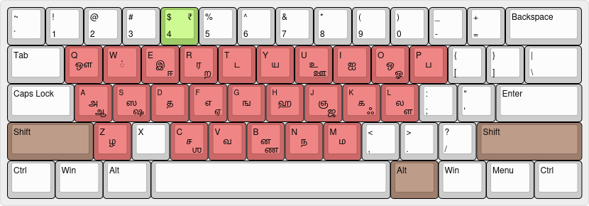
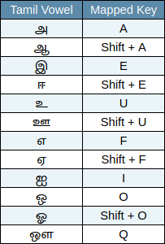
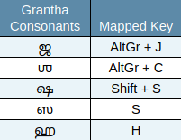
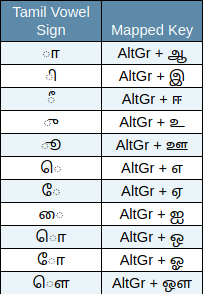

# ⌨️ ow-tamil-keyboard-linux


Ow - The easiest Tamil keyboard layout ever created — designed for Linux, based on mapping Tamil letters to English letters with similar pronunciation.

## ✨ Features
1. Fully compatible with Debian-based Linux distributions
2. Easy to install/uninstall and use
3. No need to memorise complex key mappings
4. Supports five commonly used Grantha-derived Tamil characters and the Indian rupees symbol
5. Uses only 27 keys: 25 alphabetic, 1 Shift, and 1 AltGr

## 🛠️ Installation
1. Download the latest **.deb** package from the [Releases](https://github.com/coderganesh/ow-tamil-keyboard-linux/releases) page
2. Install it using `dpkg` or your preferred package manager:
   ```bash
   sudo dpkg --install <downloaded_package_name>

## 🔧 Post-Installation Steps

1. **Add the Keyboard Layout**  
   After installation, go to your  
   **System Settings > Keyboard > Layouts**  
   and **add the newly installed layout** to start using it.

2. **Fix Right Alt (AltGr) Key Issue**  
   If the **AltGr (Right Alt)** key is not working, enable it by going to:  
   **System Settings > Keyboard > Layout Options > Key to choose 3rd level**  
   and **select "Right Alt"**.

## ⌨️ Key Mapping
**Note:** `AltGr` means **Right Alt** (the Alt key on the right side of the keyboard). 

### தமிழ் உயிர் எழுத்துகள் (Tamil Vowels):


---
### தமிழ் மெய் எழுத்துகள் (Tamil Consonants):


---
### ௧ிரந்த மெய் எழுத்துகள் (Grantha Consonants):


---
### தமிழ் உயிர்க்குறிகள் (Tamil Vowel Signs):


---
### தமிழ் ஆய்த எழுத்து (Āytam or Special Character):
`Shift + K → ஃ`

---
### இந்திய ரூபாய் குறியீடு (Indian Rupee Sign):
`AltGr + 4 → ₹`

## 🔡 Examples
1. E + M + Y + M + W = இமயம்
2. (Shift + E) + C + L + W = ஈசல்
3. N + (AltGr + E) + L + M + W = நிலம்
4. N + (AltGr + (Shift + E)) + R + W = நீர்
5. A + (Shift + K) + D + (AltGr + U) = அஃது
6. H + (AltGr + (Shift + A)) + L + W = ஹால்
7. P + S + W = பஸ்
8. (Shift + S) + (AltGr + (Shift + U)) = ஷூ

## 🛠️ Uninstallation
1. To uninstall it completely, run:
   ```bash
   sudo dpkg --purge owtamilkb
2. Go to your **System Settings > Keyboard > Layouts**  
   and **remove any entry for the uninstalled layout if it still exists**, to complete the uninstallation.

## 🔄 Update Package
Updating requires uninstalling the old version first and then installing the new one.  
Follow the steps in the installation and uninstallation sections above.

## 🙋‍♂️ Having Issues?

If you face any problems or have suggestions, feel free to [open an issue](https://github.com/coderganesh/ow-tamil-keyboard-linux/issues).
