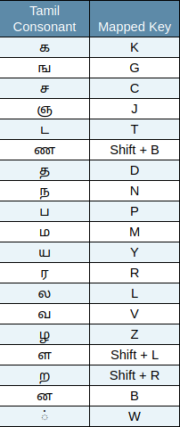

# ⌨️ ow-tamil-keyboard


Ow Tamil Keyboard — the easiest Tamil keyboard layout ever created, designed by mapping Tamil letters to English letters with similar pronunciation.

## ✨ Features
1. Uses only 27 keys: 25 alphabetic, 1 Shift, and 1 AltGr.
2. No need to memorise complex key mappings.
3. Easy to install and uninstall.
4. Fully compatible with Windows and all Debian-based Linux distributions.
5. Supports five commonly used Grantha characters and the Indian rupee symbol.

## 🛠️ Installation
### 🐧 Linux
1. Download the **.deb** package from the **latest release** on the [Releases](https://github.com/coderganesh/ow-tamil-keyboard/releases) page.
2. Install it using `apt` or your preferred package manager:
   ```bash
   sudo apt update && sudo apt install ./<downloaded_package_name>
### 🪟 Windows
1. Download the **OwLayout-v{version}.zip** file from the **latest release** on the [Releases](https://github.com/coderganesh/ow-tamil-keyboard/releases) page.
2. Extract the zip file and run **setup.exe** located inside the extracted folder.

## 🔧 Post-Installation Steps for Linux

1. **Add the Keyboard Layout**  
   After installation, go to your  
   **System Settings > Keyboard > Layouts**  
   and **add the newly installed layout** to start using it.

2. **Fix Right Alt (AltGr) Key Issue**  
   If the **AltGr (Right Alt)** key is not working, enable it by going to:  
   **System Settings > Keyboard > Layout Options > Key to choose 3rd level**  
   and **select "Right Alt"**.

## ⌨️ Key Mapping
**Note:** `AltGr` means **Right Alt** (the Alt key on the right side of the keyboard). 

### தமிழ் உயிர் எழுத்துகள் (Tamil Vowels):


---
### தமிழ் மெய் எழுத்துகள் (Tamil Consonants):


---
### கிரந்த மெய் எழுத்துகள் (Grantha Consonants):


---
### தமிழ் உயிர்க்குறிகள் (Tamil Vowel Signs):


---
### தமிழ் ஆய்த எழுத்து (Āytam or Special Character):
`Shift + K → ஃ`

---
### இந்திய ரூபாய் குறியீடு (Indian Rupee Sign):
`AltGr + 4 → ₹`

## 🔡 Examples
- `E + M + Y + M + W` → **இமயம்**
- `(Shift + E) + C + L + W` → **ஈசல்**
- `N + (AltGr + E) + L + M + W` → **நிலம்**
- `N + (AltGr + (Shift + E)) + R + W` → **நீர்**
- `A + (Shift + K) + D + (AltGr + U)` → **அஃது**
- `H + (AltGr + (Shift + A)) + L + W` → **ஹால்**
- `P + S + W` → **பஸ்**
- `(Shift + S) + (AltGr + (Shift + U))` → **ஷூ**

## 🛠️ Uninstallation
### 🐧 Linux
1. To uninstall it completely, run:
   ```bash
   sudo apt purge owtamilkb
2. Go to your **System Settings > Keyboard > Layouts**  
   and **remove any entry for the uninstalled layout if it still exists**, to complete the uninstallation.

## 🔄 How to Update
Updating requires uninstalling the old version first and then installing the new one.  
Follow the steps in the installation and uninstallation sections above.

## 🙋‍♂️ Having Issues?
If you face any problems or have suggestions, feel free to [open an issue](https://github.com/coderganesh/ow-tamil-keyboard/issues).

## License


This project is licensed under the MIT License - see the [LICENSE](LICENSE) file for details.
